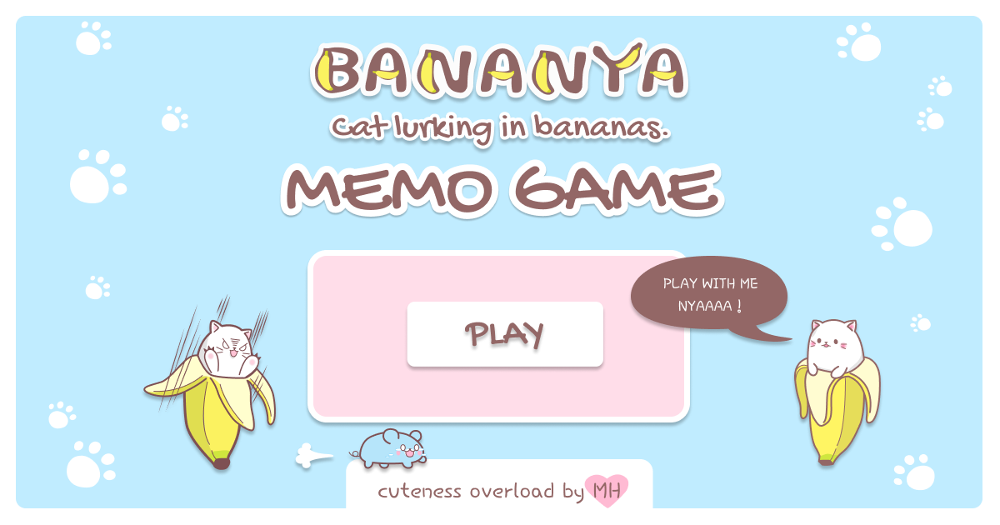

# MEMO BANANYA
Test your memory capacity in kawaii (cute) memo-bananya game! 3 levels available! Singleplayer and also Muliplayer(2players) available! Nyaaaa!

## Development state
The projects was built in Vanilla JavaScript.
I tried my best to separate buisness logic from rendering the view by creating 3 main controllers. 

- `GameController` - manage the largest part of the game. It commands rendering the settings views through View, responding to settings buttons generating the instance of Board Factory, which return the correct Board and PlayerController
- `Board` - manage the rendered board, shuffle tiles, inform PlayerController through GameController about the scores, react to emptying the board from tiles
- `PlayerController` - manage each player state (points, moves), rendering the stats and responding to action buttons

- `PWA` mode available

## How to use it?
- Clone the repository
- Install all necessary packages by `npm install`

## Available scripts
`npm run start` - runs development mode
`npm run build` - runs build process for production
`npm run publish` - runs build process and publish the page using `gh-pages` branch

## Author
Marcelina Hasiak - Design, svg graphics and coding
Webpack Starter Kit - [here](https://github.com/maciejkorsan/wtf-webpack-starter)

## License
For personal use only. Do not distribute.

